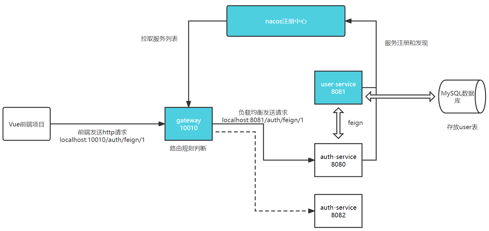

# cloud-demo-login
中行实习小demo


## 项目结构设计

后端部分的结构设计

```
cloud-backend
    - user-service  # 对user表的CURD
    - auth-service  # 模拟登录，远程调用userservice接口
    - feign-api     # feign相关代码封装
    - gateway       # 网关微服务
```


前端：vue

数据库：本地mysql数据库（临时）


主要思路：

- 登录/注册服务和用户服务都对外暴露 Restful 的接口
- 登录/注册服务如果需要查询用户信息，只能调用用户服务的Restful接口，不能查询用户数据库




蓝色为已完成模块

图中 url 只是为了展示请求转发，以及作为通过网关调用微服务的示例，不是登录服务的接口。


## 接口设计

接口文档详见：https://console-docs.apipost.cn/preview/5e57a19e88b1b9ec/d6fbaae0feb11505

