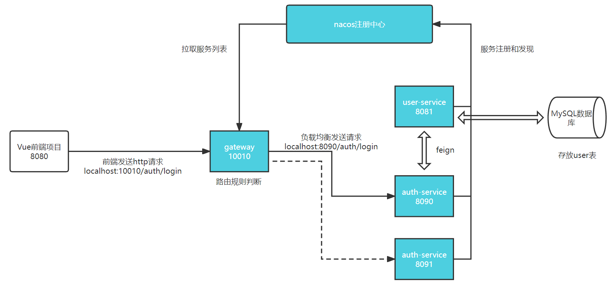
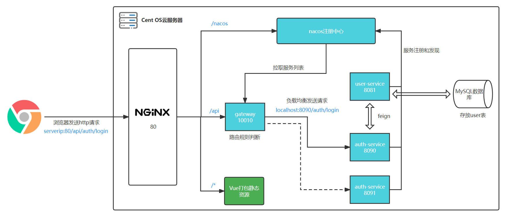
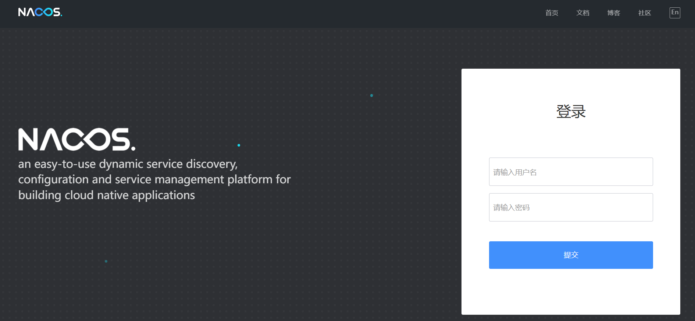
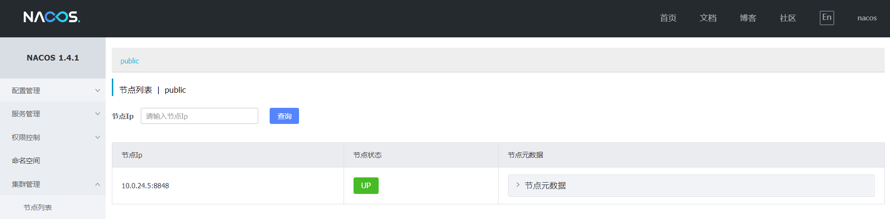
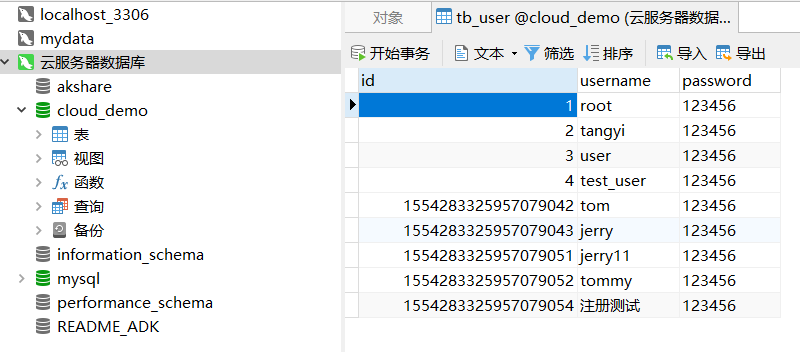

# cloud-demo-login
中行实习小demo，学习spring cloud，搭建微服务小程序


## 整体结构设计

### 表结构

| 字段     | 数据类型 | 备注         |
| -------- | -------- | ------------ |
| id       | bigint   | 自增id       |
| username | varchar  | 用户名，唯一 |
| password | varchar  | 密码         |


### 代码结构

后端部分的结构设计

```
cloud-backend
    - user-service  # 对user表的CURD
    - auth-service  # 模拟登录，远程调用userservice接口
    - feign-api     # feign相关代码封装
    - gateway       # 网关微服务
```

前端：vue

数据库：本地mysql数据库（临时）


### 主要思路

- 登录/注册服务和用户服务都对外暴露 Restful 的接口
- 登录/注册服务如果需要查询用户信息，只能调用用户服务的 Restful 接口，不能查询用户数据库


**本地版本**



**服务器部署版本**




## 接口设计

接口文档详见：https://console-docs.apipost.cn/preview/5e57a19e88b1b9ec/d6fbaae0feb11505

（**为便于在服务器上部署，修改了接口设计**）


## 项目部署

运行环境

```
CentOS 8
jdk1.8.0_144
```

配置Java环境变量

```sh
export JAVA_HOME=/usr/local/jdk1.8.0_144
export PATH=$PATH:$JAVA_HOME/bin
source /etc/profile
```


### 1. 前端Vue项目部署

使用Nginx作为服务器，部署前端项目

下载源码后，修改请求ip地址为你的服务器ip，执行

```nodejs
npm install
npm run build
```

将vue项目打包，上传至服务器

服务器部署步骤参考：[Linux安装nginx及部署Vue项目](https://segmentfault.com/a/1190000038672615#item-3)

获取腾讯云服务器公网 IP 地址：[获取公网 IP 地址](https://cloud.tencent.com/document/product/213/17940)


**Nginx常用命令**

```sh
# 如果路径不同需要修改路径
cd /usr/local/nginx/sbin/
# 启动
./nginx 
# 停止（修改配置后推荐停止nginx, 重启时配置更改可能不生效）
./nginx -s stop
./nginx -s quit
# 重启
./nginx -s reload
```


Nginx反向代理设置

```nginx
    server {
        # 1.监听 80 端口
        listen 80;
        
        # 2.这是你部署的IP，你服务器的公网IP
        server_name  101.43.193.162;

        # 3.这里配置前端打包文件的映射路径
        root /usr/local/nginx/html;

        location / {
            root   html;
            try_files $uri $uri/ /index.html;
            index  index.html index.htm;
        }

        # 反向代理nacos
        location /nacos {
            proxy_pass http://nacos;
        }

        # redirect server error pages to the static page /50x.html
        error_page   500 502 503 504  /50x.html;
        location = /50x.html {
            root   html;
        }

    }
```


### 2. 后端项目部署

#### 2.1 启动nacos

服务器上安装nacos 1.4.1（略）

由于云服务器的安全设置，8848端口未开放

通过Nginx的80端口，代理到8848端口，访问Nacos控制台

> 参考资料：https://blog.csdn.net/LuckFairyLuckBaby/article/details/123682656


修改Nginx的配置文件

```nginx
upstream nacos {
	server localhost:8848;
}

server {
    
	...
        
    # 反向代理nacos
    location /nacos {
    	proxy_pass http://nacos;
    }

}
```

配置完成后在公网访问nacos登录页面`http://{you_server_ip}/nacos/#/login`即可



默认账号密码都是`nacos`




#### 2.2 连接mysql

服务器上安装mysql 5.7（过程略）

```sh
# 重置密码
mysql -uroot
```


```mysql
mysql> use mysql;
mysql> update user set password = password('123456') where user = 'root';
mysql> flush privileges; # 到这算是成功了。
mysql> exit;
```


```sh
mysql -uroot -p  # 验证密码是否正确
```


通过 Navicat 远程连接云服务器mysql数据库（[参考](https://blog.csdn.net/qq_42900286/article/details/122971854)），导入表结构和数据。

sql文件见：`cloud-demo-login\db_example\cloud_demo.sql`

导入结果




> 可能的报错：[ERR] 1273 - Unknown collation: 'utf8mb4_0900_ai_ci'
> 报错原因：
> 生成转储文件的数据库版本为8.0,要导入sql文件的数据库版本为5.6,因为是高版本导入到低版本，引起1273错误
>
> 解决方法：
> 打开sql文件，将文件中的所有
> `utf8mb4_0900_ai_ci`替换为`utf8_general_ci`
> `utf8mb4`替换为`utf8`
> 保存后再次运行sql文件，运行成功


部署在服务器上需要注意的问题：

[解决MariaDB(mysql)中文乱码问题](https://www.jianshu.com/p/e8eb6923f639)


#### 2.3 启动springboot 程序

下载源码后，修改数据库相关配置，如用户名，密码等。

使用maven的`package`命令将三个微服务模块打三个jar包，上传至服务器运行

```sh
nohup java -jar app-auth.jar > auth.log &
nohup java -jar app-user.jar > user.log &
nohup java -jar app-gateway.jar > gateway.log &
ps -ef | grep java # 查看所有java进程
```


**需要解决跨域问题**
在后端(springcloud gateway)进行设置

> 参考资料
>
> https://www.cnblogs.com/qbbit/p/16285141.html
>
> https://www.ruanyifeng.com/blog/2016/04/cors.html


由于服务器只开放了80端口，同样在Nginx中设置反向代理

```nginx
# 反向后端接口
location /api {
    proxy_pass http://localhost:10010;
}
```


## TO-DO

- [ ] 通过 Docker部署微服务
- [ ] 基于 token 实现”真正“的登入和登出
- [ ] 通过网关进行鉴权
